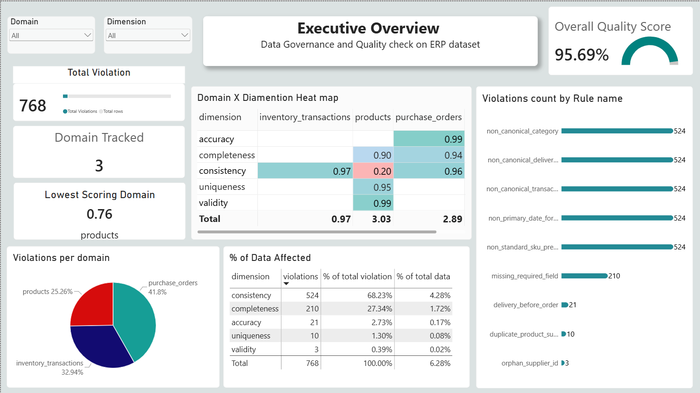

# ERP Master Data Governance & Quality Analytics

A 5-dimension data governance framework built on a messy, realistic ERP dataset —
PostgreSQL for rule enforcement, Python for profiling/standardization, and Power BI for
a drillthrough governance scorecard.

## The problem

The source ERP export (5 linked tables, ~11,200 rows) had the kind of mess real ERP
systems accumulate over time: 4 different SKU key formats for the same entity type,
category/status values scattered across inconsistent casing and whitespace, orphaned
foreign keys, and three different date formats used across three different tables (with
94 individual values not even matching their own column's dominant format).

## What this project does

1. **Assesses** data quality across 5 dimensions — completeness, uniqueness, validity,
   consistency, accuracy — implemented as SQL rule views in PostgreSQL
2. **Standardizes & enriches** the data in Python — unifies SKU formats, recovers
   malformed dates via multi-format fallback parsing, imputes missing prices via
   category median, infers missing categories via keyword matching
3. **Scores** quality per table/dimension and tracks it over time
4. **Visualizes** results in a Power BI scorecard with a domain × dimension heatmap and
   drillthrough remediation views — click a low score, see the exact broken records

## Key results

| Metric | Value |
|---|---|
| Total violations identified | 768 (each violation = one record failing one specific rule) |
| Tables assessed | 5 |
| Quality dimensions | 5 |
| Products with standardized SKU keys | 150 / 200 |
| Malformed dates auto-recovered | 94 / 94 |
| Products domain quality score | 0.76 |
| Purchase Orders domain quality score | 0.96 |
| Inventory Transactions domain quality score | 0.97 |
| Largest violation category | Consistency (68.2% of all violations) |

Full breakdown and methodology: [`Data_Quality_Report.md`](./Data_Quality_Report.md)

## Tech stack

`PostgreSQL` · `Python (pandas, SQLAlchemy)` · `SQL` · `Power BI (DAX,
drillthrough)`

## Dashboard

## Data quality rule catalog

| Dimension | Example rule |
|---|---|
| Completeness | Required fields (`category`, `price`, `supplier_id`) must not be null |
| Uniqueness | No duplicate `(product_name, supplier_id)` pairs |
| Validity | `supplier_id` must exist in `suppliers`; `price` > 0 |
| Consistency | Canonical casing for categorical fields; single SKU prefix standard |
| Accuracy | `expected_delivery_date` >= `order_date`; transaction sign matches direction |

## Notes

- Sample/practice dataset with intentionally realistic data quality issues — not
  production data from a real company.
- Percentages in the scorecard describe the *composition* of violations (what kind of
  issue dominates), not the *prevalence* across all records — see the Data Quality
  Report for the distinction.
